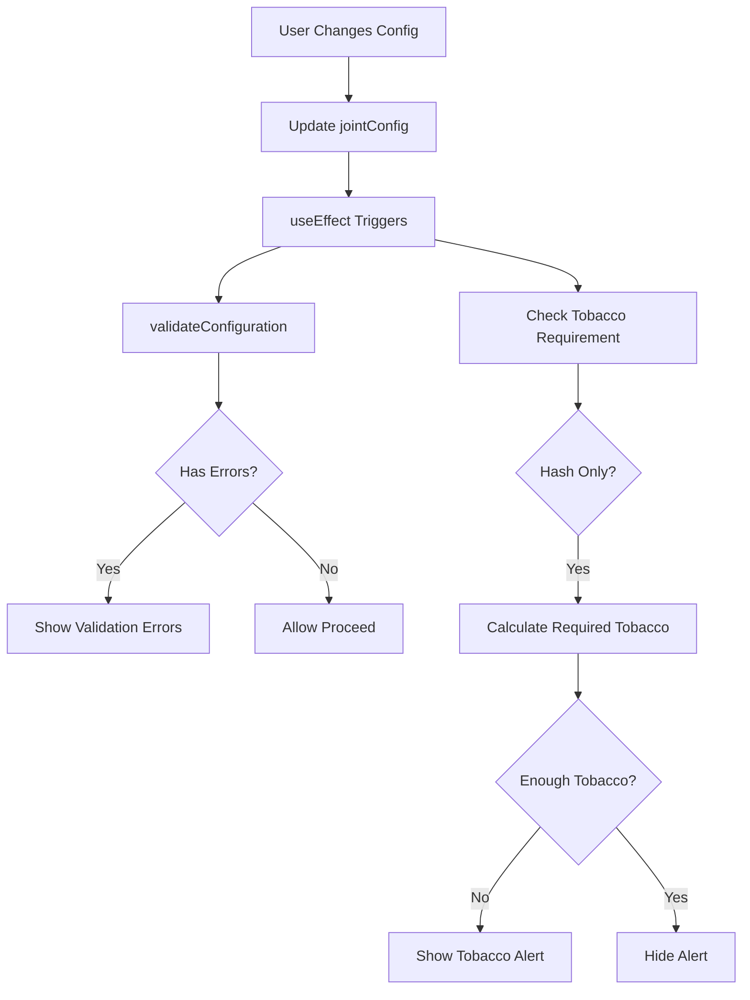

# Custom Joint Builder - Conflicts & Dosage Rules

## Overview

This document describes the business logic implementation for the Custom Joint Builder, including conflict rules and dosage calculations.

## File Structure

```
src/app/menu/personalizedJoint/
├── page.js                          # Main component with validation integration
├── utils/
│   └── conflictsAndDosages.js      # All business logic and rules
└── components/
    ├── PaperStep.js                 # Must use getAvailableFilters()
    ├── FilterStep.js                # Must check isFilterAllowed()
    ├── FillingStep.js               # Must enforce capacity limits
    ├── ExternalStep.js              # Must enforce "one external only"
    └── ReviewStep.js                # Shows validation errors
```

## Implementation Status

### ✅ Completed Features

#### 1. Conflict Management System

- **Pre-Rolled CK Cones**

  - ✅ Filter selection automatically disabled (built-in)
  - ✅ Internal worm/rosin disabled
  - ✅ Only one external top-up allowed

- **Hemp Wrap**

  - ✅ Filters: Large glass (12mm) or paper filters allowed
  - ✅ Small glass (10mm) blocked
  - ✅ One external top-up limit enforced

- **Golden Paper**

  - ✅ Filters: Paper or small glass (10mm) allowed
  - ✅ Large glass (12mm) blocked
  - ✅ One external top-up limit enforced

- **Custom Pre-Rolled (Custom Paper)**
  - ✅ Filter auto-selection by length:
    - ≤12cm → paper (2cm) or glass (10mm)
    - 12-16cm → medium paper (3.5cm)
    - 16-23cm → large paper (5cm)
  - ✅ Internal/external options allowed
  - ✅ One external top-up limit

#### 2. Dosage Calculations

- ✅ **Pre-Rolled CK**: Fixed weights (0.4g, 0.8g, 1.2g)
- ✅ **Hemp Wrap**: Standard 1.5g or 2.0g
- ✅ **Golden Paper**: Fixed 1.0g base
- ✅ **Custom Paper**: Dynamic calculation using formula:
  ```
  Effective Fill (g) = (Effective Filling Space / 18) × 7
  ```
- ✅ Filter length auto-calculated (invisible to user)
- ✅ Top-up ranges: 0.3g - 1.2g (standard), 0.5g - 1.2g (spiral)
- ✅ Step size: 0.1g throughout
- ✅ Tolerance: ±10% on capacity validation

#### 3. Hash-Only Joint Rules

- ✅ Tobacco requirement detection
- ✅ Auto-calculation: 1g tobacco per 0.5g hash
- ✅ Visual alert when tobacco missing
- ✅ Checkout blocked until requirement met
- ✅ Tobacco always available for manual adjustment

#### 4. Validation System

- ✅ Real-time configuration validation
- ✅ Error display on review step
- ✅ Capacity overflow detection
- ✅ Multiple external top-up prevention
- ✅ Filter compatibility checking

### 🚧 Pending Integration (Requires Component Updates)

The following features are **implemented in the rules system** but need to be integrated into the step components:

1. **PaperStep.js** needs to:

   - [ ] Import and use `getPreRolledWeights()` for cone sizes
   - [ ] Import and use `getHempWrapDosage()` for hemp wrap
   - [ ] Import and use `getGoldenPaperDosage()` for golden paper
   - [ ] Add custom length slider (5-23cm) for custom paper
   - [ ] Update `updateConfig()` to include paper type

2. **FilterStep.js** needs to:

   - [ ] Import and use `getAvailableFilters(paperType, jointLength)`
   - [ ] Filter out incompatible options based on paper type
   - [ ] Auto-skip step if pre-rolled cone selected
   - [ ] Show filter length info (for user education)

3. **FillingStep.js** needs to:

   - [ ] Import and use `validateFillingCapacity()`
   - [ ] Show real-time capacity display
   - [ ] Add tobacco slider (always visible)
   - [ ] Enforce `areInternalOptionsAllowed()` for worm/donut
   - [ ] Calculate and display remaining capacity
   - [ ] Block worm/donut if pre-rolled cone

4. **ExternalStep.js** needs to:

   - [ ] Enforce "only one external" rule
   - [ ] Disable second option if one is already selected
   - [ ] Import and use `getTopUpDosage()` for weight ranges
   - [ ] Show weight sliders with min/max from rules

5. **ReviewStep.js** needs to:
   - [ ] Display `validationErrors` from parent
   - [ ] Show tobacco requirement if applicable
   - [ ] Display capacity summary
   - [ ] Show all incompatibility warnings

## Usage Examples

### In PaperStep Component

```javascript
import { getAvailableFilters, PAPER_TYPES } from "../utils/conflictsAndDosages";

// When user selects hemp wrap
const selectedPaper = {
  type: PAPER_TYPES.HEMP_WRAP,
  name: "Hemp Wrap",
  price: 50,
};
updateConfig("paper", selectedPaper);

// Get allowed filters for this paper type
const allowedFilters = getAvailableFilters(PAPER_TYPES.HEMP_WRAP);
// Returns: Paper filters and glass (12mm), excludes glass (10mm)
```

### In FilterStep Component

```javascript
import { isFilterAllowed, FILTER_TYPES } from "../utils/conflictsAndDosages";

// Check if filter is compatible
const canSelectFilter = isFilterAllowed(
  config.paper.type,
  FILTER_TYPES.GLASS_SMALL,
  config.paper.customLength
);
```

### In FillingStep Component

```javascript
import {
  validateFillingCapacity,
  isTobaccoRequired,
  calculateRequiredTobacco,
} from "../utils/conflictsAndDosages";

// Validate capacity
const validation = validateFillingCapacity(
  config.paper.type,
  config.filling,
  config.paper.customLength
);

console.log(validation.remaining); // How much space left
console.log(validation.isValid); // True if within limits

// Check tobacco requirement
if (isTobaccoRequired(config.filling)) {
  const required = calculateRequiredTobacco(config.filling);
  // Show alert: "Add {required}g tobacco"
}
```

### In ExternalStep Component

```javascript
import {
  canAddMultipleExternalTopUps,
  getTopUpDosage,
} from "../utils/conflictsAndDosages";

// Check if can add more external options
const hasCoating = config.external.coating !== null;
const canAddWrap = !hasCoating; // Only one allowed

// Get dosage ranges
const dosage = getTopUpDosage(config.paper.customLength);
// Use dosage.standard.min, dosage.standard.max for sliders
```

## Validation Flow



## Next Steps for Full Implementation

1. **Update PaperStep.js**

   - Add paper type selection with visual cards
   - Add length slider for custom paper (5-23cm)
   - Use pre-defined weights for cones, hemp, golden

2. **Update FilterStep.js**

   - Filter available options based on paper type
   - Auto-skip if pre-rolled cone
   - Show filter size info

3. **Update FillingStep.js**

   - Add capacity display bar
   - Add tobacco slider (always visible)
   - Block internal worm if pre-rolled
   - Real-time capacity validation

4. **Update ExternalStep.js**

   - Implement "select one only" UI
   - Add weight sliders with correct ranges
   - Disable second option when one selected

5. **Update ReviewStep.js**

   - Show all validation errors
   - Display capacity summary
   - Show tobacco warning if needed

6. **Test All Scenarios**
   - Pre-rolled cone (no filter, no internal worm)
   - Hemp wrap (filters, capacity)
   - Golden paper (filters, fixed capacity)
   - Custom paper (length-based dosages)
   - Hash-only (tobacco requirement)
   - External top-ups (one only)

## API Reference

See `src/app/menu/personalizedJoint/utils/conflictsAndDosages.js` for full function documentation.

Key exports:

- `PAPER_TYPES` - Constants for paper types
- `FILTER_TYPES` - Constants for filter types
- `isFilterAllowed()` - Check filter compatibility
- `areInternalOptionsAllowed()` - Check if worm/donut allowed
- `isTobaccoRequired()` - Check if tobacco needed
- `calculateRequiredTobacco()` - Calculate tobacco amount
- `validateFillingCapacity()` - Check capacity limits
- `validateConfiguration()` - Full config validation
- `getCustomPaperDosage()` - Calculate dosage by length
- `getAvailableFilters()` - Get compatible filters
